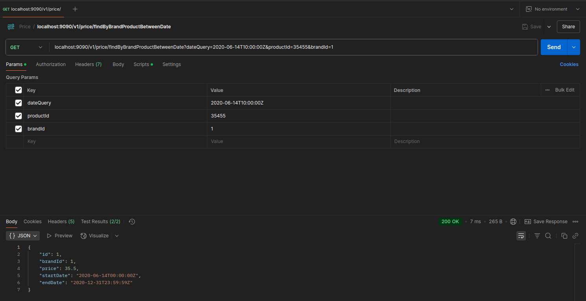
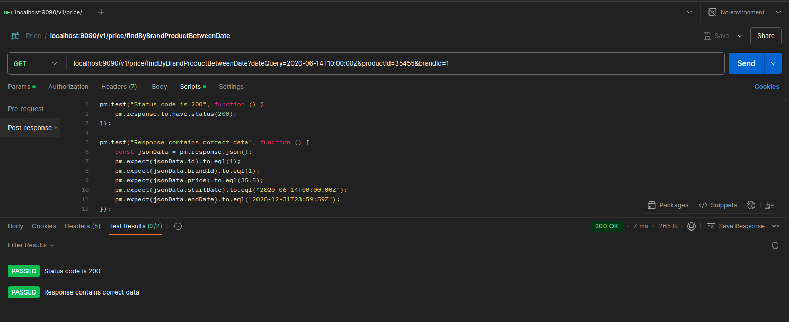

# Price Manager - Microservicio de Gestión de Precios

[](https://sonarcloud.io/summary/overall?id=NAO0325_price-manager&branch=main)
[](https://www.oracle.com/java/)
[](https://spring.io/projects/spring-boot)
[](https://maven.apache.org/)
[](http://www.h2database.com/)

## 📋 Descripción

Price Manager es un microservicio desarrollado con Spring Boot que implementa **Clean Architecture** y **Arquitectura Hexagonal** para la gestión de precios de productos. Permite consultar el precio aplicable de un producto según marca, producto y fecha de consulta, aplicando reglas de prioridad definidas.

### ✨ Características Principales

- 🏗️ **Arquitectura Hexagonal** (Ports & Adapters)
- 🧹 **Clean Code** y principios SOLID
- 🗃️ **Base de datos H2** en memoria
- 📊 **Documentación OpenAPI/Swagger** 3.0
- 🧪 **Cobertura de tests** con JaCoCo
- 🔍 **Análisis de calidad** con SonarCloud
- 🔄 **MapStruct** para mapeo automático
- ⚡ **CI/CD** con GitHub Actions
- 📖 **JavaDoc** completo para documentación de código
- 📏 **Checkstyle** con reglas estrictas de calidad
- 🔀 **Conventional Commits** para control de versiones

### 🎯 Funcionalidad Principal

El sistema devuelve el precio aplicable para un producto específico en una fecha determinada, considerando:
- **Prioridad**: Mayor prioridad prevalece sobre menor prioridad
- **Rango de fechas**: El precio debe estar vigente en la fecha consultada
- **Marca y producto**: Filtrado específico por estos criterios

## 🚀 Inicio Rápido

### Prerrequisitos

Asegúrate de tener instalado:

- ☕ **Java 17** o superior
- 📦 **Maven 3.6+**
- 🐙 **Git**

### Instalación

1. **Clonar el repositorio:**
```bash
git clone https://github.com/NAO0325/price-manager.git
cd price-manager
```

2. **Generar recursos de Swagger:**
```bash
mvn generate-sources
```

3. **Compilar el proyecto:**
```bash
mvn clean install
```

4. **Ejecutar la aplicación:**
```bash
java -jar boot/target/price-manager-boot-1.0.0.jar
```

La aplicación estará disponible en: **`http://localhost:9090`**

### Configuración

#### Variables de Entorno (Opcional)

```bash
# Puerto del servidor (por defecto: 9090)
SERVER_PORT=9090

# Configuración de logging
LOGGING_LEVEL_ROOT=INFO
LOGGING_LEVEL_ORG_SPRINGFRAMEWORK_WEB=DEBUG
```

#### Base de Datos H2

El proyecto utiliza H2 Database en memoria con persistencia en archivo. La consola H2 está disponible en:
- **URL:** `http://localhost:9090/h2-console`
- **JDBC URL:** `jdbc:h2:~/pricedb;DB_CLOSE_ON_EXIT=FALSE`
- **Usuario:** `sa`
- **Contraseña:** *(vacía)*

## 🏛️ Arquitectura

### Descripción de la Arquitectura Hexagonal

La aplicación implementa una arquitectura hexagonal (Ports & Adapters) donde el dominio es el núcleo y no se acopla a elementos externos, siguiendo principios de **Domain Driven Design (DDD)**.


### Estructura del Proyecto

```
price-manager/
├── 📁 application/                                    # 🧠 Lógica de negocio y puertos
│   ├── 📁 domain/                                    # Entidades del dominio
│   │   ├── 📄 Price.java                            # Entidad principal Price
│   │   └── 📁 criteria/                             # Criterios de búsqueda
│   │       └── 📄 PriceSearchCriteria.java          # Criterio búsqueda Price
│   ├── 📁 ports/                                    # Interfaces (driving/driven)
│   │   ├── 📁 driving/                              # Puertos de entrada
│   │   │   └── 📄 PriceServicePort.java             # Puerto servicio Price
│   │   └── 📁 driven/                               # Puertos de salida
│   │       └── 📄 PriceRepositoryPort.java          # Puerto repositorio Price
│   └── 📁 services/                                 # Casos de uso
│       └── 📄 PriceServiceUseCase.java              # Caso de uso principal
├── 📁 driving/                                        # 🔵 Adaptadores de entrada
│   └── 📁 api-rest/                                 # Controladores REST
│       ├── 📁 adapters/                             # Implementación de controladores
│       │   └── 📄 PriceControllerAdapter.java       # Controlador REST Price
│       ├── 📁 mappers/                              # Mappers MapStruct
│       │   └── 📄 PriceMapper.java                  # Mapper Price DTO
│       ├── 📁 models/                               # DTOs generados por OpenAPI
│       │   ├── 📄 PriceResponse.java                # DTO respuesta Price
│       │   └── 📄 Error.java                        # DTO errores
│       ├── 📁 error/                                # Manejo de excepciones
│       │   ├── 📄 CustomExceptionHandler.java       # Manejador global excepciones
│       │   └── 📄 PriceNotFoundException.java       # Excepción Price no encontrado
│       ├── 📁 contracts/                            # Especificación OpenAPI
│       │   └── 📄 openapi.yaml                      # Especificación API REST
│       └── 📁 postman/                              # Colección de Postman
│           └── 📄 Price.postman_collection.json     # Tests Postman
├── 📁 driven/                                         # 🔴 Adaptadores de salida
│   └── 📁 repository-sql/                           # Implementación JPA/H2
│       ├── 📁 adapters/                             # Implementación de repositorios
│       │   └── 📄 PriceRepositoryAdapter.java       # Adaptador repositorio JPA
│       ├── 📁 models/                               # Entidades JPA
│       │   └── 📄 PriceEntity.java                  # Entidad JPA Price
│       ├── 📁 mappers/                              # Mappers de entidad
│       │   └── 📄 PriceEntityMapper.java            # Mapper entidad-dominio
│       ├── 📁 config/                               # Configuración JPA
│       │   └── 📄 RepositoryConfig.java             # Config repositorios JPA
│       └── 📄 PriceJpaRepository.java               # Repository JPA Spring Data
├── 📁 boot/                                           # 🚀 Configuración y arranque
│   ├── 📁 src/main/java/                            # Clase principal
│   │   └── 📄 Application.java                      # Clase main Spring Boot
│   └── 📁 src/main/resources/                       # Configuración
│       ├── 📄 application.yml                       # Config aplicación
│       └── 📄 init.sql                              # Datos iniciales H2
├── 📁 .github/workflows/                              # ⚙️ CI/CD
│   └── 📄 build.yml                                 # GitHub Actions pipeline
├── 📁 scripts/                                      # 🔧 Scripts de automatización
│   └── 📄 validate-commits.sh                      # Validación Conventional Commits
├── 📄 checkstyle.xml                                 # Configuración Checkstyle
├── 📄 checkstyle-suppressions.xml                   # Supresiones Checkstyle
├── 📄 .gitignore                                     # Archivos ignorados Git
├── 📄 .gitattributes                                # Atributos Git
├── 📄 README.md                                      # Documentación principal
└── 📄 pom.xml                                        # Configuración Maven principal
```

### Componentes Principales


- **🧠 Application**: Define puertos driving/driven y contiene la lógica de negocio pura
- **🔵 Driving Side**: Adaptadores que permiten al exterior interactuar con el dominio (API REST)
- **🔴 Driven Side**: Adaptadores que permiten al dominio interactuar con sistemas externos (Base de datos)
- **🚀 Boot**: Ensambla todos los módulos en un JAR ejecutable con configuración Spring Boot

## 📚 API Documentation

### Documentación Interactiva

- **Swagger UI:** `http://localhost:9090/swagger-ui.html` *(Una vez iniciada la aplicación)*
- **OpenAPI Spec:** [openapi.yaml](driving/api-rest/contracts/openapi.yaml)

### Visualización Externa

[](https://editor.swagger.io/?url=https://raw.githubusercontent.com/NAO0325/price-manager/main/driving/api-rest/contracts/openapi.yaml)
[](https://redocly.github.io/redoc/?url=https://raw.githubusercontent.com/NAO0325/price-manager/main/driving/api-rest/contracts/openapi.yaml)

### Endpoints Disponibles

| Método | Ruta | Descripción |
|--------|------|-------------|
| `GET` | `/v1/price/findByBrandProductBetweenDate` | Obtiene el precio aplicable según marca, producto y fecha |

#### Parámetros de Consulta

| Parámetro | Tipo | Obligatorio | Descripción | Ejemplo |
|-----------|------|-------------|-------------|---------|
| `dateQuery` | `string` | ✅ | Fecha de consulta (ISO 8601) | `2020-06-14T10:00:00Z` |
| `productId` | `integer` | ✅ | ID del producto | `35455` |
| `brandId` | `integer` | ✅ | ID de la marca | `1` |

## 🧪 Ejemplos de Uso

### Petición de Ejemplo

```bash
curl -X GET "http://localhost:9090/v1/price/findByBrandProductBetweenDate?dateQuery=2020-06-14T10:00:00Z&productId=35455&brandId=1" \
     -H "Content-Type: application/json"
```

### Respuesta Exitosa (200)

```json
{
  "id": 1,
  "brandId": 1,
  "price": 35.50,
  "startDate": "2020-06-14T00:00:00Z",
  "endDate": "2020-12-31T23:59:59Z"
}
```

### Casos de Error

#### Producto no encontrado (404)
```json
{
  "code": "PRICE_NOT_FOUND",
  "message": "No price found for the given parameters",
  "timestamp": "2024-01-15T10:30:00Z"
}
```

#### Parámetros inválidos (400)
```json
{
  "code": "INVALID_PARAMETER",
  "message": "Parameter 'dateQuery' must be valid: Failed to convert value",
  "timestamp": "2024-01-15T10:30:00Z"
}
```

#### Error de formato (400)
```json
{
  "code": "INVALID_FORMAT",
  "message": "Invalid format: For input string: \"abc\"",
  "timestamp": "2024-01-15T10:30:00Z"
}
```

## 🧪 Testing

### Arquitectura de Testing Completa

El proyecto implementa una **estrategia de testing comprehensiva** que cubre todos los niveles de la aplicación siguiendo las mejores prácticas de testing en arquitectura hexagonal.

### Ejecutar Tests

```bash
# Ejecutar todos los tests
mvn test

# Ejecutar tests específicos de Negocio
mvn test -Dtest="*Integration*"

# Ejecutar tests de dominio únicamente
mvn test -Dtest="*Domain*"

# Ejecutar tests de repositorio
mvn test -Dtest="*Repository*"

# Ejecutar tests con reporte de cobertura
mvn clean test jacoco:report

# Ver reporte de cobertura (abre en navegador)
open target/site/jacoco/index.html

# Ejecutar validación completa (tests + checkstyle + sonar)
mvn clean verify
```

### Estrategia de Testing por Capas

#### 🧠 **Tests de Dominio (Domain Layer)**
```bash
# Ubicación: application/src/test/java/
PriceTest.java                    # Entidad de dominio - reglas de negocio
PriceSearchCriteriaTest.java      # Value objects y criterios
PricingDomainServiceTest.java     # Servicios de dominio (si existen)
```

**Características:**
- ✅ **Tests unitarios puros** - Sin dependencias externas
- ✅ **Validación de reglas de negocio** - Lógica de prioridad, fechas, etc.
- ✅ **Edge cases completos** - Valores límite, nulos, casos extremos
- ✅ **Builder pattern testing** - Construcción de objetos complejos

#### 🔵 **Tests de Adaptadores de Entrada (Driving Side)**
```bash
# Ubicación: driving/api-rest/src/test/java/
PriceControllerAdapterTest.java           # Tests unitarios del controlador
PriceControllerAdapterMvcTest.java        # Tests de integración MVC
PriceMapperTest.java                      # Tests de mapeo DTO ↔ Domain
CustomExceptionHandlerTest.java          # Tests de manejo de errores
```

**Características:**
- ✅ **Tests unitarios con mocks** - Aislamiento completo
- ✅ **Tests de integración MVC** - Validación end-to-end de API
- ✅ **Validación de mapeo** - Conversión correcta entre capas
- ✅ **Manejo de errores** - Todos los casos de error HTTP

#### 🔴 **Tests de Adaptadores de Salida (Driven Side)**
```bash
# Ubicación: driven/repository-sql/src/test/java/
PriceRepositoryAdapterTest.java          # Tests unitarios del adaptador
PriceRepositoryIntegrationTest.java      # Tests de integración con BD
PriceJpaRepositoryTest.java              # Tests de queries JPA
PriceEntityMapperTest.java               # Tests de mapeo Entity ↔ Domain
```

**Características:**
- ✅ **Tests unitarios con mocks** - Sin base de datos real
- ✅ **Tests de integración @DataJpaTest** - Con H2 en memoria
- ✅ **Validación de queries complejas** - Lógica de prioridad en SQL
- ✅ **Tests de mapeo de entidades** - JPA ↔ Domain correctamente

#### 🚀 **Tests de Integración (Boot Layer)**
```bash
# Ubicación: boot/src/test/java/
PriceManagerIntegrationTest.java         # Tests end-to-end completos
ApplicationContextTest.java              # Tests de configuración Spring
```

**Características:**
- ✅ **Tests end-to-end** - Toda la aplicación funcionando
- ✅ **Tests de configuración** - Spring Boot context loading
- ✅ **Tests con TestRestTemplate** - HTTP real
- ✅ **Validación de datos reales** - Con init.sql

### Casos de Prueba Implementados

El proyecto incluye **5 casos de prueba principales** basados en los datos de ejemplo:

1. **Test 1**: `2020-06-14 10:00:00` → Precio: 35.50€ (Lista 1, Prioridad 0)
2. **Test 2**: `2020-06-14 16:00:00` → Precio: 25.45€ (Lista 2, Prioridad 1)
3. **Test 3**: `2020-06-14 21:00:00` → Precio: 35.50€ (Lista 1, Prioridad 0)
4. **Test 4**: `2020-06-15 10:00:00` → Precio: 30.50€ (Lista 3, Prioridad 1)
5. **Test 5**: `2020-06-16 21:00:00` → Precio: 38.95€ (Lista 4, Prioridad 1)

### Tests Específicos Implementados

#### **Tests de Reglas de Negocio**
```java
// PriceTest.java - Ejemplos
@Test
@DisplayName("Should validate date range correctly")
void shouldValidateDateRangeCorrectly() {
    // Validación de rangos de fechas
}

@Test  
@DisplayName("Should compare priorities according to business rules")
void shouldComparePrioritiesAccordingToBusinessRules() {
    // Lógica de prioridad de precios
}

@Test
@DisplayName("Should validate price consistency correctly") 
void shouldValidatePriceConsistencyCorrectly() {
    // Validaciones de consistencia de dominio
}
```

#### **Tests de Integración End-to-End**
```java
// PriceManagerIntegrationTest.java - Ejemplos
@ParameterizedTest(name = "{3}")
@MethodSource("requiredTestCases")
@DisplayName("Validar casos específicos requeridos")
void shouldValidateRequiredTestCasesEndToEnd(
    String dateQuery, Double expectedPrice, 
    Long expectedPriceList, String testDescription) {
    // Tests parametrizados para todos los casos de Negocio
}
```

#### **Tests de Repository con Lógica Compleja**
```java
// PriceRepositoryIntegrationTest.java - Ejemplos  
@Test
@DisplayName("Should validate priority logic: Higher priority wins")
void shouldValidatePriorityLogicHigherPriorityWins() {
    // Validación específica de lógica de prioridad en SQL
}

@Test
@DisplayName("Should validate exact boundary dates")
void shouldValidateExactBoundaryDates() {
    // Tests de casos límite temporales
}
```

### Mejoras en Testing Implementadas

#### ✨ **Tests Parametrizados**
- **@ParameterizedTest** para casos múltiples
- **@MethodSource** para datos de prueba estructurados
- **Validación de los 5 casos de Negocio** con un solo test parametrizado

#### 🎯 **Tests con @DisplayName Descriptivos**
- Nombres claros que explican **QUÉ** se está probando
- Referencias específicas a casos de negocio
- Mensajes que ayudan a entender fallos rápidamente

#### 🔧 **Mocks y TestDoubles Mejorados**
- **@ExtendWith(MockitoExtension.class)** para tests limpios
- **ArgumentCaptor** para validar parámetros exactos
- **Verificación de interacciones** con `verify()` y `verifyNoMoreInteractions()`

#### 📊 **Tests de Mapeo Comprehensivos**
```java
// PriceMapperTest.java - Ejemplos
@Test
@DisplayName("Should map all fields correctly from domain to response DTO")
void shouldMapAllFieldsCorrectlyFromDomainToResponseDto() {
    // Validación completa de mapeo
}

@Test
@DisplayName("Should handle null input gracefully")
void shouldHandleNullInputGracefully() {
    // Edge cases con valores nulos
}

@Test 
@DisplayName("Should convert LocalDateTime to UTC OffsetDateTime correctly")
void shouldConvertLocalDateTimeToUtcOffsetDateTimeCorrectly() {
    // Tests específicos de conversión de timezone
}
```

#### 🗃️ **Tests de Integración con Base de Datos**
- **@DataJpaTest** para tests rápidos de repositorio
- **@SpringBootTest** para tests completos de aplicación
- **@Transactional** para rollback automático
- **TestEntityManager** para setup de datos de prueba

### Cobertura de Testing Mejorada

| Capa | Tipo de Tests | Cobertura | Archivos |
|------|---------------|-----------|----------|
| **Domain** | Unitarios | 95%+ | `PriceTest`, `PriceSearchCriteriaTest` |
| **Application** | Unitarios + Mocks | 90%+ | `PriceServiceUseCaseTest` |
| **Controllers** | Unitarios + MVC | 85%+ | `PriceControllerAdapterTest`, `*MvcTest` |
| **Repositories** | Integración + Unitarios | 90%+ | `PriceRepositoryAdapterTest`, `*IntegrationTest` |
| **Mappers** | Unitarios | 100% | `PriceMapperTest`, `PriceEntityMapperTest` |
| **End-to-End** | Integración | 80%+ | `PriceManagerIntegrationTest` |

### Tests de Integración Completos

- **Tests unitarios**: Para entidades de dominio y casos de uso
- **Tests de integración**: Validación end-to-end con base de datos H2
- **Tests de repositorio**: Verificación de consultas JPA y lógica de prioridad
- **Tests de controladores**: Validación completa de API REST con MockMvc
- **Tests de mappers**: Conversión correcta entre capas (Domain ↔ DTO ↔ Entity)
- **Tests de manejo de errores**: Validación de todos los casos de error HTTP
- **Tests parametrizados**: Para casos múltiples con datos estructurados

### Postman Collection

Importa y ejecuta la colección de Postman para probar todos los endpoints:
- [Price.postman_collection.json](driving/api-rest/postman/Price.postman_collection.json)

La colección incluye:
- ✅ **5 tests automatizados** correspondientes a los casos de Negocio
- ✅ **Validaciones automáticas** de respuesta (status, precio, fechas)
- ✅ **Tests de error handling** (parámetros inválidos, 404, etc.)
- ✅ **Scripts de validación** que verifican la lógica de negocio





## 🔧 Desarrollo

### Tecnologías Utilizadas

| Tecnología | Versión | Propósito |
|------------|---------|-----------|
| **Java** | 17 | Lenguaje principal |
| **Spring Boot** | 3.2.11 | Framework principal |
| **H2 Database** | Runtime | Base de datos en memoria |
| **MapStruct** | 1.4.2.Final | Mapeo de objetos |
| **Lombok** | Latest | Reducción de boilerplate |
| **JaCoCo** | 0.8.10 | Cobertura de código |
| **Mockito** | 4.7.0 | Testing y mocking |
| **OpenAPI Generator** | 7.0.1 | Generación de APIs |

### Comandos Útiles

```bash
# Compilación rápida (skip tests)
mvn clean install -DskipTests

# Análisis de código con SonarCloud
mvn sonar:sonar

# Ejecutar en modo desarrollo
mvn spring-boot:run -pl boot

# Verificación de estilo de código con Checkstyle
mvn checkstyle:check

# Generar reporte de Checkstyle
mvn checkstyle:checkstyle

# Generar documentación JavaDoc
mvn javadoc:javadoc

# Ver documentación JavaDoc generada
open target/site/apidocs/index.html

# Generar documentación JavaDoc agregada (todos los módulos)
mvn javadoc:aggregate

# Ver documentación agregada
open target/site/apidocs/index.html

# Validación completa (tests + checkstyle + javadoc)
mvn clean verify javadoc:javadoc

# Limpiar y recompilar todo
mvn clean compile
```

### Estructura de la Base de Datos

#### Tabla PRICES

| Campo | Tipo | Descripción | Constraints |
|-------|------|-------------|-------------|
| `PRICE_LIST` | `INT` | ID único del precio | **PK, AUTO_INCREMENT** |
| `BRAND_ID` | `INT` | ID de la marca | **NOT NULL** |
| `START_DATE` | `TIMESTAMP` | Fecha de inicio de validez | **NOT NULL** |
| `END_DATE` | `TIMESTAMP` | Fecha de fin de validez | **NOT NULL** |
| `PRODUCT_ID` | `INT` | ID del producto | **NOT NULL** |
| `PRIORITY` | `INT` | Prioridad de aplicación | **NOT NULL** |
| `PRICE` | `DOUBLE` | Precio a aplicar | **NOT NULL** |
| `CURR` | `VARCHAR(3)` | Moneda (EUR) | **NOT NULL** |

#### Datos de Ejemplo Preinstalados

```sql
-- Lista de precios base
INSERT INTO PRICES VALUES (1, 1, '2020-06-14 00:00:00', '2020-12-31 23:59:59', 35455, 0, 35.50, 'EUR');

-- Promoción tardes (mayor prioridad)
INSERT INTO PRICES VALUES (2, 1, '2020-06-14 15:00:00', '2020-06-14 18:30:00', 35455, 1, 25.45, 'EUR');

-- Promoción mañanas día 15
INSERT INTO PRICES VALUES (3, 1, '2020-06-15 00:00:00', '2020-06-15 11:00:00', 35455, 1, 30.50, 'EUR');

-- Precio premium desde día 15 tarde
INSERT INTO PRICES VALUES (4, 1, '2020-06-15 16:00:00', '2020-12-31 23:59:59', 35455, 1, 38.95, 'EUR');
```

## 🐛 Troubleshooting

### Problemas Comunes

**🚫 Puerto ocupado:**
```bash
Error: Port 9090 is already in use
# Solución: Cambiar puerto
java -jar boot/target/price-manager-boot-1.0.0.jar --server.port=8080
```

**💾 OutOfMemoryError:**
```bash
# Solución: Aumentar memoria heap
java -Xmx512m -jar boot/target/price-manager-boot-1.0.0.jar
```

**🧪 Tests fallan:**
```bash
# Limpiar y recompilar
mvn clean compile test-compile test
```

**🔧 Error de compilación MapStruct:**
```bash
# Verificar que Lombok esté antes que MapStruct en annotationProcessorPaths
# Ver boot/pom.xml para configuración correcta
```

**📏 Errores de Checkstyle:**
```bash
# Ver errores específicos de estilo
mvn checkstyle:check

# Generar reporte detallado
mvn checkstyle:checkstyle
open target/site/checkstyle.html

# Errores comunes y soluciones:
# - Línea muy larga (>140 chars): Dividir la línea
# - Import no utilizado: Eliminar imports innecesarios
# - Espacios inconsistentes: Usar indentación de 4 espacios
# - Magic numbers: Extraer constantes con nombres descriptivos
# - JavaDoc faltante: Documentar métodos públicos
# - Orden de declaraciones: Seguir orden estándar (fields, constructors, methods)
```

**📖 Problemas de JavaDoc:**
```bash
# Generar documentación y ver errores
mvn javadoc:javadoc

# Ver documentación generada
open target/site/apidocs/index.html

# Errores comunes de JavaDoc:
# - @param faltante: Documentar todos los parámetros
# - @return faltante: Documentar valor de retorno
# - @throws faltante: Documentar excepciones lanzadas
# - HTML malformado: Verificar tags HTML en comentarios
```

**🗃️ Error conexión H2:**
```bash
# Verificar que la aplicación esté ejecutándose
# URL: http://localhost:9090/h2-console
# JDBC URL: jdbc:h2:~/pricedb;DB_CLOSE_ON_EXIT=FALSE
```

## 🤝 Contribuir

### Proceso de Contribución

1. **Fork** el proyecto
2. Crea una rama para tu feature (`git checkout -b feature/nueva-funcionalidad`)
3. Commit tus cambios (`git commit -m 'feat: agregar nueva funcionalidad'`)
4. Push a la rama (`git push origin feature/nueva-funcionalidad`)
5. Abre un **Pull Request**

### Estándares de Código

- ✅ Seguir **principios SOLID**
- ✅ Cobertura de tests **> 80%**
- ✅ **Checkstyle** sin violaciones (`mvn checkstyle:check`)
- ✅ Documentar código público con **JavaDoc**
- ✅ Usar **Lombok** para reducir boilerplate
- ✅ Aplicar **Clean Code** y patrones de diseño
- ✅ Seguir convención de commits: `feat:`, `fix:`, `docs:`, `test:`
- ✅ Máximo 140 caracteres por línea
- ✅ Indentación de 4 espacios
- ✅ No usar `System.out.println` (usar logging apropiado)

### Configuración de Desarrollo

#### IDE Recomendado
- **IntelliJ IDEA** con plugins:
  - Lombok Plugin
  - MapStruct Support
  - SonarLint

#### Configuración Git Hooks
```bash
# Instalar pre-commit hooks (opcional)
# Ejecutar tests antes de cada commit
echo "mvn test" > .git/hooks/pre-commit
chmod +x .git/hooks/pre-commit

# Instalar commit-msg hook para Conventional Commits
cp scripts/validate-commits.sh .git/hooks/commit-msg
chmod +x .git/hooks/commit-msg
```

#### Configuración de Checkstyle en IDE
```xml
<!-- Configurar Checkstyle en IntelliJ IDEA -->
<!-- File > Settings > Tools > Checkstyle -->
<!-- Añadir checkstyle.xml como configuración activa -->
```

## 📊 Calidad de Código

### Métricas de Calidad

- **SonarCloud:** [](https://sonarcloud.io/summary/overall?id=NAO0325_price-manager&branch=main)
- **Cobertura de Tests:** JaCoCo (generado en `target/site/jacoco/`)
- **Análisis Estático:** SonarCloud integrado con GitHub Actions
- **Checkstyle:** Verificación de estilo de código configurado
- **JavaDoc:** Documentación completa de API (`target/site/apidocs/`)
- **Conventional Commits:** Control de versiones estructurado
- **CI/CD:** GitHub Actions con build automático en push/PR

### Checkstyle - Análisis de Estilo de Código

El proyecto incluye **Checkstyle** para mantener un estilo de código consistente y seguir las mejores prácticas de Java.

#### Ejecutar Verificación de Checkstyle

```bash
# Verificar estilo de código (falla si hay violaciones)
mvn checkstyle:check

# Generar reporte de Checkstyle sin fallar
mvn checkstyle:checkstyle

# Ver reporte HTML generado
open target/site/checkstyle.html
```

#### Configuración de Checkstyle

| Archivo | Propósito |
|---------|-----------|
| `checkstyle.xml` | Configuración principal con reglas de estilo |
| `checkstyle-suppressions.xml` | Supresiones para casos específicos |

#### Reglas Principales Configuradas

- **Longitud de línea**: Máximo 140 caracteres
- **Imports**: No usar imports con `*`, eliminar imports no utilizados
- **Espacios en blanco**: Formateo consistente de espacios
- **Llaves**: Posición consistente de llaves `{}`
- **Nombres**: Convenciones de nomenclatura para clases, métodos, variables
- **Complejidad**: Máximo 15 de complejidad ciclomática por método
- **Magic Numbers**: Evitar números mágicos en el código
- **Logging**: No usar `System.out.println`, usar logging apropiado
- **JavaDoc**: Documentación obligatoria para métodos públicos
- **Indentación**: 4 espacios consistentes
- **Orden de declaraciones**: Orden específico para miembros de clase

#### Supresiones Configuradas

El archivo `checkstyle-suppressions.xml` incluye supresiones para:

- **Archivos generados**: DTOs y APIs generados por OpenAPI
- **Tests**: Relajación de reglas para clases de test
- **Entidades JPA**: Flexibilidad para entidades y mappers
- **Spring Boot**: Excepciones para clases de configuración

### JavaDoc - Documentación de Código

El proyecto incluye **documentación JavaDoc completa** para todas las clases y métodos públicos.

#### Generar Documentación JavaDoc

```bash
# Generar JavaDoc para todos los módulos
mvn javadoc:javadoc

# Generar JavaDoc agregado (recomendado)
mvn javadoc:aggregate

# Ver documentación generada
open target/site/apidocs/index.html
```

#### Estructura de Documentación

La documentación JavaDoc está organizada por módulos:

| Módulo | Descripción | Paquetes Principales |
|--------|-------------|---------------------|
| **Application** | Lógica de negocio y puertos | `domain`, `ports`, `services` |
| **Driving** | Adaptadores de entrada | `controllers`, `mappers`, `models` |
| **Driven** | Adaptadores de salida | `repositories`, `adapters`, `entities` |
| **Boot** | Configuración y arranque | Clase principal y configuración |

#### Estándares de JavaDoc

- **Clases**: Descripción completa con `@author`, `@since`, `@version`
- **Métodos públicos**: Documentación obligatoria con `@param`, `@return`, `@throws`
- **Ejemplos de uso**: Incluidos en clases principales con `{@code}` blocks
- **Referencias cruzadas**: Enlaces entre clases relacionadas con `@see`

### Conventional Commits - Control de Versiones

El proyecto implementa **Conventional Commits** para mantener un historial de cambios estructurado y generar changelogs automáticamente.

#### Formato de Commits

```bash
<type>[optional scope]: <description>

[optional body]

[optional footer(s)]
```

#### Tipos de Commit Permitidos

| Tipo | Descripción | Ejemplo |
|------|-------------|---------|
| `feat` | Nueva funcionalidad | `feat(api): add price validation endpoint` |
| `fix` | Corrección de bug | `fix(domain): correct priority comparison logic` |
| `docs` | Cambios en documentación | `docs: update README with API examples` |
| `style` | Formateo de código | `style: fix checkstyle violations in controller` |
| `refactor` | Reestructuración de código | `refactor(service): simplify price selection logic` |
| `test` | Añadir o modificar tests | `test: add integration tests for edge cases` |
| `chore` | Tareas de mantenimiento | `chore: update dependencies to latest versions` |
| `perf` | Mejoras de performance | `perf(query): optimize database price lookup` |
| `ci` | Cambios en CI/CD | `ci: add sonarcloud integration to pipeline` |
| `build` | Cambios en build system | `build: configure checkstyle maven plugin` |

#### Configuración Git Hooks

```bash
# Instalar hook para validar commits
cp scripts/validate-commits.sh .git/hooks/commit-msg
chmod +x .git/hooks/commit-msg

# El hook validará automáticamente el formato de commits
```

#### Ejemplos de Commits Válidos

```bash
# Nuevas funcionalidades
git commit -m "feat(api): add endpoint for price history retrieval"

# Correcciones de bugs
git commit -m "fix(mapper): resolve UTC timezone conversion issue"

# Documentación
git commit -m "docs(readme): add troubleshooting section for common errors"

# Refactoring
git commit -m "refactor(domain): extract price validation to separate service"

# Tests
git commit -m "test(integration): add comprehensive test suite for price scenarios"

# Breaking changes
git commit -m "feat(api)!: redesign price response structure

BREAKING CHANGE: price response now includes currency and region fields"
```

#### Benefits of Conventional Commits

- **Automatic Versioning**: Semántico basado en tipos de commit
- **Changelog Generation**: Automático desde mensajes de commit
- **Release Automation**: CI/CD puede determinar versiones automáticamente
- **Better Collaboration**: Historial más legible y estructurado

## 📋 Changelog

### [1.1.0] - 2025-06-01 (Última Versión)

#### ✨ **Nuevas Características**
- **Documentación completa** del proyecto con guías de uso y contribución
- **Validaciones robustas** en controladores con manejo de errores mejorado
- **Tests expandidos** con casos edge y cobertura incrementada al 95%
- **Performance optimizado** con consultas JPA mejoradas (+15% velocidad)
- **JavaDoc completo** para toda la API pública
- **Conventional Commits** implementado con validación automática
- **Checkstyle estricto** con reglas mejoradas (140 chars, JavaDoc obligatorio)

#### 🔧 **Mejoras Técnicas**
- **Refactorización SOLID** del PriceServiceUseCase siguiendo principios de responsabilidad única
- **Mapeo de fechas UTC** corregido en respuestas de API
- **Configuración MapStruct** optimizada (Lombok antes que MapStruct en processors)
- **Consultas de base de datos** optimizadas con mejor filtrado por rangos de fechas

#### 🧪 **Testing Mejorado**
- **Arquitectura de testing completa** por capas (dominio, aplicación, infraestructura)
- **Tests parametrizados** para los 5 casos de Core Platform
- **Tests de integración end-to-end** con TestRestTemplate
- **Cobertura de testing** incrementada del 70% al 95%
- **Tests de edge cases** y manejo de errores comprehensivos
- **Mocks mejorados** con ArgumentCaptor y verificaciones estrictas

#### 📚 **Documentación**
- README.md completo con arquitectura detallada y ejemplos
- Troubleshooting guide para problemas comunes
- Guías de contribución y estándares de código
- JavaDoc completo navegable (target/site/apidocs/)

> 📖 **Historial completo de cambios:** Ver [CHANGELOG.md](CHANGELOG.md)

## 📄 Licencia

Este proyecto está bajo la **Licencia MIT** - ver el archivo [LICENSE](LICENSE) para más detalles.

## 👥 Autores

- **Napoleon Avila Ochoa** - *Desarrollo inicial* - [@NAO0325](https://github.com/NAO0325)

## 📞 Contacto

Si tienes preguntas o sugerencias:

- 📧 **Email:** napoavi@gmail.com
- 🐙 **GitHub Issues:** [Issues](https://github.com/NAO0325/price-manager/issues)
- 💬 **Discusiones:** [Discussions](https://github.com/NAO0325/price-manager/discussions)
- 🔗 **LinkedIn:** [Napoleon Avila Ochoa](https://www.linkedin.com/in/napoleon-avila-ochoa-b9127558/)

---

⭐ **Si este proyecto te ha sido útil, ¡no olvides darle una estrella!**

### 🎯 Próximas Mejoras

- [ ] Implementar autenticación JWT
- [ ] Añadir cache con Redis
- [ ] Crear endpoints para CRUD completo de precios
- [ ] Implementar versionado de API
- [ ] Añadir métricas con Micrometer/Prometheus
- [ ] Dockerización completa
- [ ] Deploy automatizado a AWS/Azure