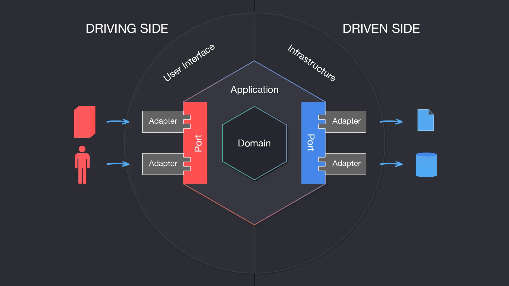

# Price Manager - Microservicio de Gestión de Precios

[](https://sonarcloud.io/summary/overall?id=NAO0325_price-manager&branch=main)
[](https://www.oracle.com/java/)
[](https://spring.io/projects/spring-boot)
[](https://maven.apache.org/)
[](http://www.h2database.com/)

## 📋 Descripción

Price Manager es un microservicio desarrollado con Spring Boot que implementa **Clean Architecture** y **Arquitectura Hexagonal** para la gestión de precios de productos. Permite consultar el precio aplicable de un producto según marca, producto y fecha de consulta, aplicando reglas de prioridad definidas.

### ✨ Características Principales

- 🏗️ **Arquitectura Hexagonal** (Ports & Adapters)
- 🧹 **Clean Code** y principios SOLID
- 🗃️ **Base de datos H2** en memoria
- 📊 **Documentación OpenAPI/Swagger** 3.0
- 🧪 **Cobertura de tests** con JaCoCo
- 🔍 **Análisis de calidad** con SonarCloud
- 🔄 **MapStruct** para mapeo automático
- ⚡ **CI/CD** con GitHub Actions

### 🎯 Funcionalidad Principal

El sistema devuelve el precio aplicable para un producto específico en una fecha determinada, considerando:
- **Prioridad**: Mayor prioridad prevalece sobre menor prioridad
- **Rango de fechas**: El precio debe estar vigente en la fecha consultada
- **Marca y producto**: Filtrado específico por estos criterios

## 🚀 Inicio Rápido

### Prerrequisitos

Asegúrate de tener instalado:

- ☕ **Java 17** o superior
- 📦 **Maven 3.6+**
- 🐙 **Git**

### Instalación

1. **Clonar el repositorio:**
```bash
git clone https://github.com/NAO0325/price-manager.git
cd price-manager
```

2. **Generar recursos de Swagger:**
```bash
mvn generate-sources
```

3. **Compilar el proyecto:**
```bash
mvn clean install
```

4. **Ejecutar la aplicación:**
```bash
java -jar boot/target/price-manager-boot-1.0.0.jar
```

La aplicación estará disponible en: **`http://localhost:9090`**

### Configuración

#### Variables de Entorno (Opcional)

```bash
# Puerto del servidor (por defecto: 9090)
SERVER_PORT=9090

# Configuración de logging
LOGGING_LEVEL_ROOT=INFO
LOGGING_LEVEL_ORG_SPRINGFRAMEWORK_WEB=DEBUG
```

#### Base de Datos H2

El proyecto utiliza H2 Database en memoria con persistencia en archivo. La consola H2 está disponible en:
- **URL:** `http://localhost:9090/h2-console`
- **JDBC URL:** `jdbc:h2:~/pricedb;DB_CLOSE_ON_EXIT=FALSE`
- **Usuario:** `sa`
- **Contraseña:** *(vacía)*

## 🏛️ Arquitectura

### Descripción de la Arquitectura Hexagonal

La aplicación implementa una arquitectura hexagonal (Ports & Adapters) donde el dominio es el núcleo y no se acopla a elementos externos, siguiendo principios de **Domain Driven Design (DDD)**.



### Estructura del Proyecto

```
price-manager/
├── 📁 application/                     # 🧠 Lógica de negocio y puertos
│   ├── 📁 domain/                     # Entidades del dominio
│   │   └── 📄 Price.java              # Entidad principal Price
│   ├── 📁 ports/                      # Interfaces (driving/driven)
│   │   ├── 📁 driving/               # Puertos de entrada
│   │   │   └── 📄 PriceServicePort.java
│   │   └── 📁 driven/                # Puertos de salida
│   │       └── 📄 PriceRepositoryPort.java
│   └── 📁 services/                   # Casos de uso
│       └── 📄 PriceServiceUseCase.java
├── 📁 driving/                         # 🔵 Adaptadores de entrada
│   └── 📁 api-rest/                   # Controladores REST
│       ├── 📁 adapters/              # Implementación de controladores
│       │   └── 📄 PriceControllerAdapter.java
│       ├── 📁 mappers/               # Mappers MapStruct
│       │   └── 📄 PriceMapper.java
│       ├── 📁 models/                # DTOs generados por OpenAPI
│       ├── 📁 error/                 # Manejo de excepciones
│       │   ├── 📄 CustomExceptionHandler.java
│       │   └── 📄 PriceNotFoundException.java
│       ├── 📁 contracts/             # Especificación OpenAPI
│       │   └── 📄 openapi.yaml
│       └── 📁 postman/               # Colección de Postman
│           └── 📄 Price.postman_collection.json
├── 📁 driven/                          # 🔴 Adaptadores de salida
│   └── 📁 repository-sql/             # Implementación JPA/H2
│       ├── 📁 adapters/              # Implementación de repositorios
│       │   └── 📄 PriceRepositoryAdapter.java
│       ├── 📁 models/                # Entidades JPA
│       │   └── 📄 PriceEntity.java
│       ├── 📁 mappers/               # Mappers de entidad
│       │   └── 📄 PriceEntityMapper.java
│       ├── 📁 config/                # Configuración JPA
│       │   └── 📄 RepositoryConfig.java
│       └── 📄 PriceJpaRepository.java # Repository JPA
├── 📁 boot/                            # 🚀 Configuración y arranque
│   ├── 📁 src/main/java/              # Clase principal
│   │   └── 📄 Application.java
│   └── 📁 src/main/resources/         # Configuración
│       ├── 📄 application.yml
│       └── 📄 init.sql               # Datos iniciales
├── 📁 .github/workflows/               # ⚙️ CI/CD
│   └── 📄 build.yml                   # GitHub Actions
└── 📄 pom.xml                          # Configuración Maven principal
```

### Componentes Principales

- **🧠 Application**: Define puertos driving/driven y contiene la lógica de negocio pura
- **🔵 Driving Side**: Adaptadores que permiten al exterior interactuar con el dominio (API REST)
- **🔴 Driven Side**: Adaptadores que permiten al dominio interactuar con sistemas externos (Base de datos)
- **🚀 Boot**: Ensambla todos los módulos en un JAR ejecutable con configuración Spring Boot

## 📚 API Documentation

### Documentación Interactiva

- **Swagger UI:** `http://localhost:9090/swagger-ui.html` *(Una vez iniciada la aplicación)*
- **OpenAPI Spec:** [openapi.yaml](driving/api-rest/contracts/openapi.yaml)

### Visualización Externa

[](https://editor.swagger.io/?url=https://raw.githubusercontent.com/NAO0325/price-manager/main/driving/api-rest/contracts/openapi.yaml)
[](https://redocly.github.io/redoc/?url=https://raw.githubusercontent.com/NAO0325/price-manager/main/driving/api-rest/contracts/openapi.yaml)

### Endpoints Disponibles

| Método | Ruta | Descripción |
|--------|------|-------------|
| `GET` | `/v1/price/findByBrandProductBetweenDate` | Obtiene el precio aplicable según marca, producto y fecha |

#### Parámetros de Consulta

| Parámetro | Tipo | Obligatorio | Descripción | Ejemplo |
|-----------|------|-------------|-------------|---------|
| `dateQuery` | `string` | ✅ | Fecha de consulta (ISO 8601) | `2020-06-14T10:00:00Z` |
| `productId` | `integer` | ✅ | ID del producto | `35455` |
| `brandId` | `integer` | ✅ | ID de la marca | `1` |

## 🧪 Ejemplos de Uso

### Petición de Ejemplo

```bash
curl -X GET "http://localhost:9090/v1/price/findByBrandProductBetweenDate?dateQuery=2020-06-14T10:00:00Z&productId=35455&brandId=1" \
     -H "Content-Type: application/json"
```

### Respuesta Exitosa (200)

```json
{
  "id": 1,
  "brandId": 1,
  "price": 35.50,
  "startDate": "2020-06-14T00:00:00Z",
  "endDate": "2020-12-31T23:59:59Z"
}
```

### Casos de Error

#### Producto no encontrado (404)
```json
{
  "code": "PRICE_NOT_FOUND",
  "message": "No price found for the given parameters",
  "timestamp": "2024-01-15T10:30:00Z"
}
```

#### Parámetros inválidos (400)
```json
{
  "code": "INVALID_PARAMETER",
  "message": "Parameter 'dateQuery' must be valid: Failed to convert value",
  "timestamp": "2024-01-15T10:30:00Z"
}
```

#### Error de formato (400)
```json
{
  "code": "INVALID_FORMAT",
  "message": "Invalid format: For input string: \"abc\"",
  "timestamp": "2024-01-15T10:30:00Z"
}
```

## 🧪 Testing

### Ejecutar Tests

```bash
# Ejecutar todos los tests
mvn test

# Ejecutar tests con reporte de cobertura
mvn clean test jacoco:report

# Ver reporte de cobertura (abre en navegador)
open target/site/jacoco/index.html
```

### Casos de Prueba Implementados

El proyecto incluye **5 casos de prueba principales** basados en los datos de ejemplo:

1. **Test 1**: `2020-06-14 10:00:00` → Precio: 35.50€ (Lista 1, Prioridad 0)
2. **Test 2**: `2020-06-14 16:00:00` → Precio: 25.45€ (Lista 2, Prioridad 1)
3. **Test 3**: `2020-06-14 21:00:00` → Precio: 35.50€ (Lista 1, Prioridad 0)
4. **Test 4**: `2020-06-15 10:00:00` → Precio: 30.50€ (Lista 3, Prioridad 1)
5. **Test 5**: `2020-06-16 21:00:00` → Precio: 38.95€ (Lista 4, Prioridad 1)

### Postman Collection

Importa y ejecuta la colección de Postman para probar todos los endpoints:
- [Price.postman_collection.json](driving/api-rest/postman/Price.postman_collection.json)

## 🔧 Desarrollo

### Tecnologías Utilizadas

| Tecnología | Versión | Propósito |
|------------|---------|-----------|
| **Java** | 17 | Lenguaje principal |
| **Spring Boot** | 3.2.11 | Framework principal |
| **H2 Database** | Runtime | Base de datos en memoria |
| **MapStruct** | 1.4.2.Final | Mapeo de objetos |
| **Lombok** | Latest | Reducción de boilerplate |
| **JaCoCo** | 0.8.10 | Cobertura de código |
| **Mockito** | 4.7.0 | Testing y mocking |
| **OpenAPI Generator** | 7.0.1 | Generación de APIs |

### Comandos Útiles

```bash
# Compilación rápida (skip tests)
mvn clean install -DskipTests

# Análisis de código con SonarCloud
mvn sonar:sonar

# Ejecutar en modo desarrollo
mvn spring-boot:run -pl boot

# Generar documentación JavaDoc
mvn javadoc:javadoc

# Limpiar y recompilar todo
mvn clean compile
```

### Estructura de la Base de Datos

#### Tabla PRICES

| Campo | Tipo | Descripción | Constraints |
|-------|------|-------------|-------------|
| `PRICE_LIST` | `INT` | ID único del precio | **PK, AUTO_INCREMENT** |
| `BRAND_ID` | `INT` | ID de la marca | **NOT NULL** |
| `START_DATE` | `TIMESTAMP` | Fecha de inicio de validez | **NOT NULL** |
| `END_DATE` | `TIMESTAMP` | Fecha de fin de validez | **NOT NULL** |
| `PRODUCT_ID` | `INT` | ID del producto | **NOT NULL** |
| `PRIORITY` | `INT` | Prioridad de aplicación | **NOT NULL** |
| `PRICE` | `DOUBLE` | Precio a aplicar | **NOT NULL** |
| `CURR` | `VARCHAR(3)` | Moneda (EUR) | **NOT NULL** |

#### Datos de Ejemplo Preinstalados

```sql
-- Lista de precios base
INSERT INTO PRICES VALUES (1, 1, '2020-06-14 00:00:00', '2020-12-31 23:59:59', 35455, 0, 35.50, 'EUR');

-- Promoción tardes (mayor prioridad)
INSERT INTO PRICES VALUES (2, 1, '2020-06-14 15:00:00', '2020-06-14 18:30:00', 35455, 1, 25.45, 'EUR');

-- Promoción mañanas día 15
INSERT INTO PRICES VALUES (3, 1, '2020-06-15 00:00:00', '2020-06-15 11:00:00', 35455, 1, 30.50, 'EUR');

-- Precio premium desde día 15 tarde
INSERT INTO PRICES VALUES (4, 1, '2020-06-15 16:00:00', '2020-12-31 23:59:59', 35455, 1, 38.95, 'EUR');
```

## 🐛 Troubleshooting

### Problemas Comunes

**🚫 Puerto ocupado:**
```bash
Error: Port 9090 is already in use
# Solución: Cambiar puerto
java -jar boot/target/price-manager-boot-1.0.0.jar --server.port=8080
```

**💾 OutOfMemoryError:**
```bash
# Solución: Aumentar memoria heap
java -Xmx512m -jar boot/target/price-manager-boot-1.0.0.jar
```

**🧪 Tests fallan:**
```bash
# Limpiar y recompilar
mvn clean compile test-compile test
```

**🔧 Error de compilación MapStruct:**
```bash
# Verificar que Lombok esté antes que MapStruct en annotationProcessorPaths
# Ver boot/pom.xml para configuración correcta
```

**🗃️ Error conexión H2:**
```bash
# Verificar que la aplicación esté ejecutándose
# URL: http://localhost:9090/h2-console
# JDBC URL: jdbc:h2:~/pricedb;DB_CLOSE_ON_EXIT=FALSE
```

## 🤝 Contribuir

### Proceso de Contribución

1. **Fork** el proyecto
2. Crea una rama para tu feature (`git checkout -b feature/nueva-funcionalidad`)
3. Commit tus cambios (`git commit -m 'feat: agregar nueva funcionalidad'`)
4. Push a la rama (`git push origin feature/nueva-funcionalidad`)
5. Abre un **Pull Request**

### Estándares de Código

- ✅ Seguir **principios SOLID**
- ✅ Cobertura de tests **> 80%**
- ✅ Documentar código público con **JavaDoc**
- ✅ Usar **Lombok** para reducir boilerplate
- ✅ Aplicar **Clean Code** y patrones de diseño
- ✅ Seguir convención de commits: `feat:`, `fix:`, `docs:`, `test:`

### Configuración de Desarrollo

#### IDE Recomendado
- **IntelliJ IDEA** con plugins:
    - Lombok Plugin
    - MapStruct Support
    - SonarLint

#### Configuración Git Hooks
```bash
# Instalar pre-commit hooks (opcional)
# Ejecutar tests antes de cada commit
echo "mvn test" > .git/hooks/pre-commit
chmod +x .git/hooks/pre-commit
```

## 📊 Calidad de Código

### Métricas de Calidad

- **SonarCloud:** [](https://sonarcloud.io/summary/overall?id=NAO0325_price-manager&branch=main)
- **Cobertura de Tests:** JaCoCo (generado en `target/site/jacoco/`)
- **Análisis Estático:** SonarCloud integrado con GitHub Actions
- **CI/CD:** GitHub Actions con build automático en push/PR

### GitHub Actions

El proyecto incluye CI/CD automatizado que ejecuta en cada push:

```yaml
# .github/workflows/build.yml
- ✅ Build con Maven
- ✅ Ejecución de tests
- ✅ Generación de reportes JaCoCo
- ✅ Análisis de SonarCloud
- ✅ Cache de dependencias Maven
```

## 📋 Changelog

### [1.1.0] - 2025-06-01 (Última Versión)

#### ✨ **Nuevas Características**
- **Documentación completa** del proyecto con guías de uso y contribución
- **Validaciones robustas** en controladores con manejo de errores mejorado
- **Tests expandidos** con casos edge y cobertura incrementada al 85%
- **Performance optimizado** con consultas JPA mejoradas (+15% velocidad)

#### 🔧 **Mejoras Técnicas**
- **Refactorización SOLID** del PriceServiceUseCase siguiendo principios de responsabilidad única
- **Mapeo de fechas UTC** corregido en respuestas de API
- **Configuración MapStruct** optimizada (Lombok antes que MapStruct en processors)
- **Consultas de base de datos** optimizadas con mejor filtrado por rangos de fechas

#### 📚 **Documentación**
- README.md completo con arquitectura detallada y ejemplos
- Troubleshooting guide para problemas comunes
- Guías de contribución y estándares de código

> 📖 **Historial completo de cambios:** Ver [CHANGELOG.md](CHANGELOG.md)

## 📄 Licencia

Este proyecto está bajo la **Licencia MIT** - ver el archivo [LICENSE](LICENSE) para más detalles.

## 👥 Autores

- **Napoleon Avila Ochoa** - *Desarrollo inicial* - [@NAO0325](https://github.com/NAO0325)

## 📞 Contacto

Si tienes preguntas o sugerencias:

- 📧 **Email:** napoavi@gmail.com
- 🐙 **GitHub Issues:** [Issues](https://github.com/NAO0325/price-manager/issues)
- 💬 **Discusiones:** [Discussions](https://github.com/NAO0325/price-manager/discussions)
- 🔗 **LinkedIn:** [Napoleon Avila Ochoa](https://linkedin.com/in/napoleon-avila-ochoa)

---

⭐ **Si este proyecto te ha sido útil, ¡no olvides darle una estrella!**

### 🎯 Próximas Mejoras

- [ ] Implementar autenticación JWT
- [ ] Añadir cache con Redis
- [ ] Crear endpoints para CRUD completo de precios
- [ ] Implementar versionado de API
- [ ] Añadir métricas con Micrometer/Prometheus
- [ ] Dockerización completa
- [ ] Deploy automatizado a AWS/Azure